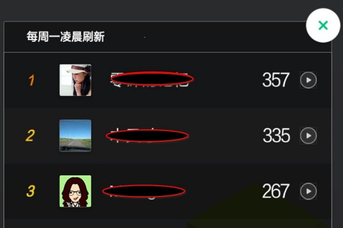
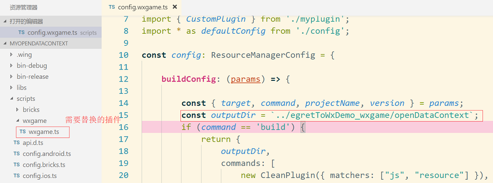
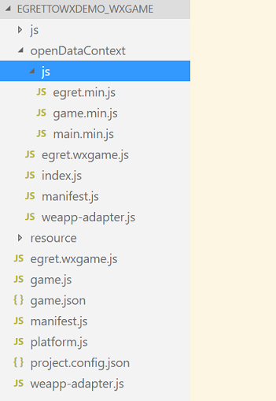

## 开放数据域的使用

### 小游戏开放注册并添加了关系链数据，这一篇主要讲述利用关系链数据开发社交类游戏。

  
  
  * 这张图片是来自于微信小游戏的跳一跳排行榜，小游戏不但开放了用户注册也把关系链数据开放了出来，有了这些数据普通的开发者也可以开发出类似的排行榜功能，有了关系链数据，会大大增加游戏玩法，玩家之间的互动，给游戏带来了更大的趣味性。
  
  * 小游戏主要提供了 ```wx.getFriendCloudStorage()``` 和 ```wx.getGroupCloudStorage()``` 两个 API 接口。但是为了保护关系链数据，小游戏增加了开放数据域的概念，开放数据域只能在离屏画布（sharedCanvas）上使用，这块画布和主域是可以共享的，我们需要把 sharedCanvas 绘制到主域上，这个过程需要开发者接触底层的 canvas 底层 API，对于不熟悉的同学会带来很大的不便，所以白鹭引擎对做了进一步的优化与封装。

  * 请开发者先阅读微信小游戏开放数据的 [文档](https://mp.weixin.qq.com/debug/wxagame/dev/tutorial/open-ability/open-data.html?t=2018323) 这样对关系链会有更好的理解。

### 使用示例：

1、白鹭引擎使用开放数据域的原理简介。关系链数据必须在开放数据域中获取。引擎在主域中使用 `window["sharedCanvas"]` 接口获取到 sharedCanvas，然后直接使用 sharedCanvas 作为 `egret.Bitmap` 的 `egret.BitmapData` ，添加在主域的舞台上即可。这样在使用上带来了极大的方便性。

2、由于 `开放数据域 是一个封闭、独立的 JavaScript 作用域` 所以要建立两个 egret 项目，主域项目 (egretToWxDemo) 和开放数据域项目 (myOpenDataContext) ，为了减少小游戏的体积，在开放数据域项目中只保留 `egret`、`game`两个模块。关于图片的加载可以白鹭提供的 `egret.ImageLoader` 或者直接使用 微信小游戏原生提供的 `Image` 对象进行加载。

3、在 launcher 中将主域项目发布成小游戏项目，发布成功后得到一个 `egretToWxDemo_wxgame` 文件夹，然后需要在 game.json 中添加配置项 openDataContext 指定开放数据域的代码目录，这里我们填写 openDataContext，一会我们要将开放数据域的项目发布到这里。修改 Main.ts 文件，将离屏画布绘制到主域上；

```
  //主要示例代码开始
  const bitmapdata = new egret.BitmapData(window["sharedCanvas"]);
  bitmapdata.$deleteSource = false;
  const texture = new egret.Texture();
  texture._setBitmapData(bitmapdata);
  this.bitmap = new egret.Bitmap(texture);
  this.bitmap.width = this.stage.stageWidth;
  this.bitmap.height = this.stage.stageHeight;
  this.addChild(this.bitmap);

  egret.startTick((timeStarmp: number) => {
      egret.WebGLUtils.deleteWebGLTexture(bitmapdata.webGLTexture);
      bitmapdata.webGLTexture = null;
      return false;
  }, this);
  //主要示例代码结束  
```

```
{
	"deviceOrientation": "portrait",
	"networkTimeout": {
		"request": 5000,
		"connectSocket": 5000,
		"uploadFile": 5000,
		"downloadFile": 5000
	},
	"openDataContext": "openDataContext"
}
```

4、再使用 wing 打开开放数据域项目，打开 egretProperties.json 配置模块中值保留 `egret`、`game` 、'promise'模块，删除 resource 目录下所有内容，这是为了减少游戏的体积。

```
  "modules": [
    {
      "name": "egret"
    },
    {
      "name": "game"
    },
    {
      "name": "promise"
    }
  ]
```
5、在开放数据域 script 目录里打开 config.wxgame.ts 文件。 输出路径 (outputDir) 改为 `../egretToWxDemo_wxgame/openDataContext`，然后把 demo 中的 wxgame.ts 插件替换到 script 的 wxgame 目录内。



6、由于开放数据域可以使用主域的图片资源，我们直接利用主域内的图片，修改 Main.ts 文件，由于篇幅所限，具体见示例 demo。

7、在 launcher 中将开放数据域项目发布成小游戏，这时有可能发布的目录不正确，不要着急，回到开放数据域项目中执行 `egret publish --target wxgame` 命令，如果报错请在主域发布的小游戏项目中找到 openDataContext 目录，创建一个 index.js 文件，再次回到开放数据域项目中执行 `egret publish --target wxgame` 命令，正常情况发布成功后如图所示。



### 注意事项
  * 一定要帧率为 60 帧。避免屏幕闪烁。
  * 开发后数据域尽量少使用库。

今天就先写到这里，具体可以参考示例 demo，如您在开发过程中遇到任何问题，请登录官方论坛进行[讨论](http://bbs.egret.com)。示例 [demo](https://github.com/peony-ma/wxOpenDataContext.git) 下载。