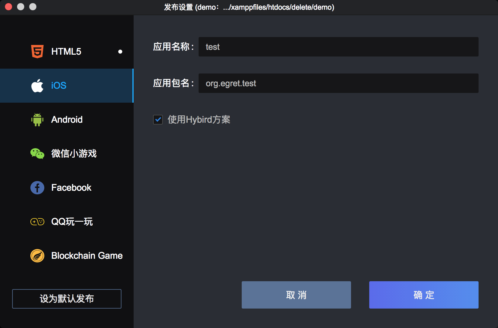

## 发布工程

### 发布设置前的准备工作

- Hybrid 方案目前仅支持 iOS 系统
- 安装最新版本的launcher
- 安装Xcode
    - 最低版本: 9.0
    - 后续需要在Xcode中完成发布项目的修改和功能接入

### 发布项目
- 在launcher的项目面板找到需要发布iOS工程的Egret项目，点击发布设置


- 点击左侧的iOS按钮，在右侧页面中，输入应用名称、应用包名，点击确定。**勾选使用Hybrid方案**



### 注意

- 双击xcworkspace文件打开工程
- 创建的工程默认打开示例游戏，需要自行修改游戏地址

## 工程模版说明

默认工程是从本地启动游戏。

### 启动流程

- 初始化EgretWebViewLib

```
[EgretWebViewLib initialize:@"/egretGame/preload/"];
// "/egretGame/preload/"是缓存目录，在应用的document目录下。
```
- 检查游戏资源是否已经部署到本地服务器

```
[EgretWebViewLib checkLoaded:zipFilePath Host:host]
// zipFilePath是游戏资源zip的绝对路径
// host是游戏映射到哪个url下，如host为"https://egret.com/game/"，对应的游戏url为"https://egret.com/game/index.html"
```
- 将游戏资源部署到本地服务器

```
ZipFileLoader* loader = [EgretWebViewLib createZipFileLoader:zipFilePath Host:host Delegate:self];
[loader start];
```
- 启动游戏

```
[EgretWebViewLib startLocalServer]; // 启动本地服务器
[EgretWebViewLib startGame:gameUrl SuperView:self.view]; // 启动游戏
```

## 另外两种启动方式

### 直接启动游戏

```objective-c
[EgretWebViewLib startGame: SuperView:];
```

### 下载游戏资源到本地，从本地启动游戏

- 检查本地游戏资源版本（根据文件名判断是否加载过）

```objective-c
[EgretWebViewLib checkLoaded:];
```

- 下载游戏资源

```objective-c
ZipFileLoader* loader = [EgretWebViewLib createZipFileLoader: Delegate:];
[loader start];
```

- 启动本地服务器和游戏

```objective-c
[EgretWebViewLib startLocalServer];
[EgretWebViewLib startGame: SuperView:];
```

## JS与OC通信

逻辑和Android Native相同，只是原生工程的API不同。

注册接收消息的方法：

```objective-c
[EgretWebViewLib setExternalInterface:@"sendToNative" Callback:^(NSString* msg) {
    NSLog(@"message: %@", msg);
}];
```

发送消息：

```objective-c
[EgretWebViewLib callExternalInterface:@"sendToJS" Value:@"message from OC"];
```

## 注意

### Web存储

如果采用从本地服务器启动游戏的方案，可能会出现“Web存储失效”的问题，如 localStorage 不能获得上次启动保存的数据。原因是每次启动本地服务器占用的端口号是不固定的（固定端口号可能会审核被拒），按照浏览器缓存策略这部分数据不能共享。

解决方案：通过ExternalInterface调用原生代码存储数据。
